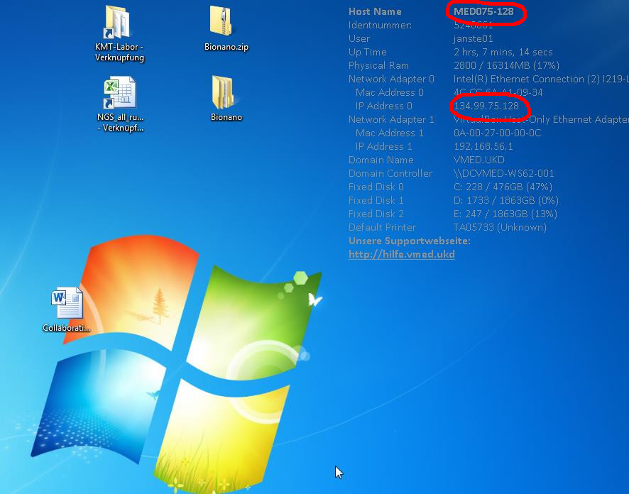

## How to access your data
There are two levels of data access. You are most likely interested in exploring your variations via the interactive browser based system [SNuPy](https://snupy-aqua.bio.inf.h-brs.de/).
However, for the advanced user, it might be necessary to access more upstream versions of your data, e.g. [bam files](http://samtools.github.io/hts-specs/SAMv1.pdf) or even [fastq raw files](https://en.wikipedia.org/wiki/FASTQ_format).
Here, I describe how to gain access to this later types of data.

There are three obstacles between you and your data:
### 1. HHU account
We are using the great service and the thousands of processors of the *High Performance Computing* (https://wiki.hhu.de/display/HPC) at Heinrich Heine University. Responsible for cluster administration is [Dr. Stephan Raub](raub@hhu.de) and is supported by the very skilled and enormously helpful [Philipp Rehs](philipp.rehs@hhu.de).
You need to have a personal HHU account (= Uni Kennung), since the data are hosted at this HPC at HHU. UKD members are generelly eligable for this account, but have to apply manually via this [form](https://www.zim.hhu.de/fileadmin/redaktion/Oeffentliche_Medien/ZIM/Formulare/unikennung_gaeste_zim.pdf).
It might take up to two weeks until you get your credentials, thus better plan ahead of time.

### 2. UKD Firewall
The UKD computer network is tightly protected internat attacks or data breaches by a quite restrictive firewall. You need to ask [IT](Hotline.IKT@med.uni-duesseldorf.de) to drill a tiny hole for your needs through this big wall in order to access the data from your office computer. You do you by writing a friendly email to Hotline.IKT@med.uni-duesseldorf.de asking for this firewall rule exception. They want to know your IP address and Host Name. Both are displayed in the upper right corner of your Windows desktop:

You should furthermore state why you need this special access and might want to refer to my (Stefan Maximilian Janssen), since I had some communications with IT about this topic. Write to the generic ITK-Hotline address, but you might indicate that this request should be forwarded to the firewall specialists, currently Hans-Jürgen Herder. Last, CC Ute Fischer or me to make this request look legitimate.

### 3. HPC permissions
Once the firewall is open towards the HPC, you need to ask the administrators to grant you reading access to /gpfs/project/projects/spike/Intermediate/ or better specific subdirectories which we have to define specifically for your needs. Again, reference Ute Fischer or me for legitimation. Either use email or https://rocketchat.hhu.de/ for even faster response.
